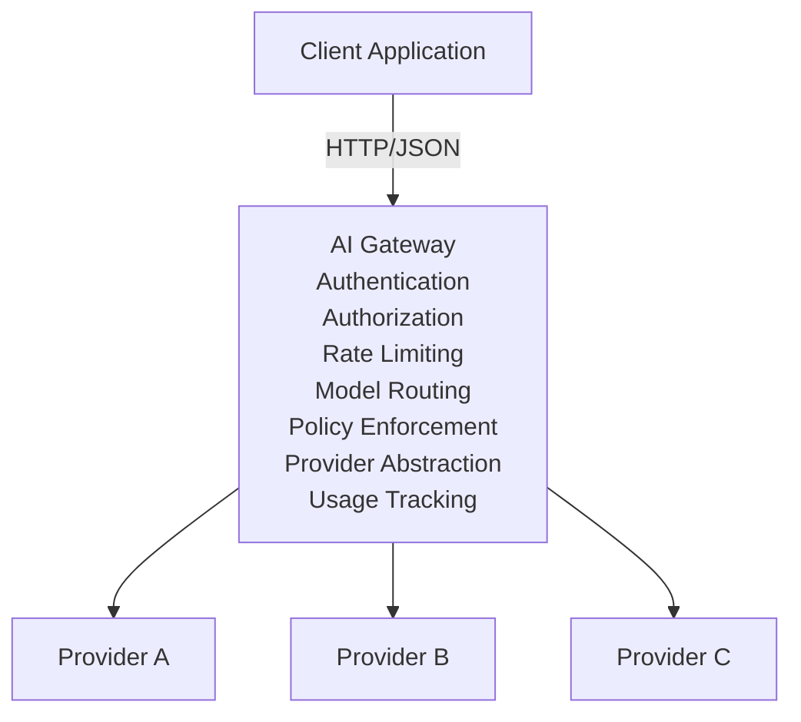
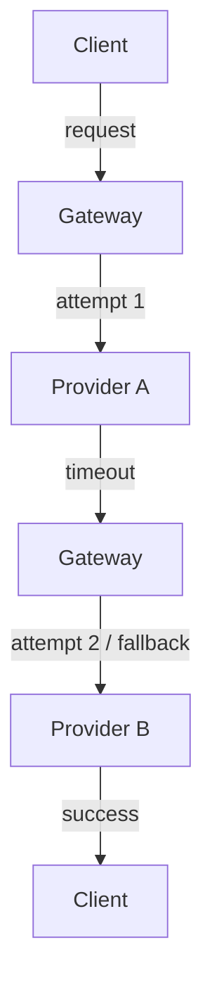
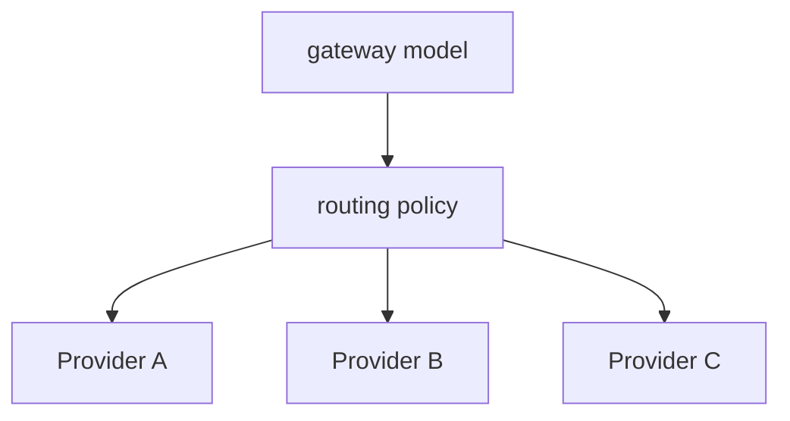
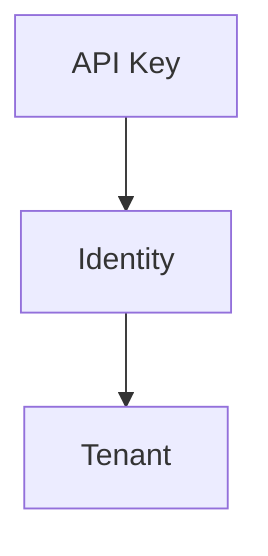
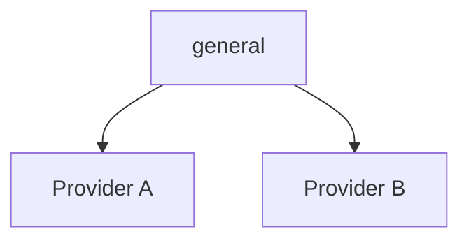

# AI Gateway — API

> ## Document status
>
> This document is the **target** API. It was written before implementation
> and deliberately describes more than the gateway currently does, so treat
> each section by its state as of Phase 3 (`specs/004-domain-validation`):
>
> **Implemented and verified**
> - [5. Content Type](#5-content-type) — JSON only; anything else is `415`
> - [7. Health API](#7-health-api), [8. Readiness API](#8-readiness-api)
> - [9. Chat Completions API](#9-chat-completions-api) over `POST /v1/chat/completions`
> - [10. Chat Request](#10-chat-request) and
>   [11. Request Fields](#11-request-fields) — `model`, `messages`,
>   `temperature`, `max_tokens`, `stream`
> - [13. Chat Response](#13-chat-response) — a fixed mock, not a real completion
> - [18. Error Handling](#18-error-handling) and
>   [21. Validation Errors](#21-validation-errors) — the flat two-field
>   `{"code", "message"}` object, the 1 MiB body bound, and the validation
>   precedence order
> - [22. Provider Errors](#22-provider-errors) — the two new provider
>   failure codes
>
> **Not implemented yet**
> - [4. Authentication](#4-authentication), [6. Request IDs](#6-request-ids)
> - [15. Usage](#15-usage) accounting (the mock response reports fixed counts)
> - [16. Streaming API](#16-streaming-api) — `stream: true` returns
>   `400 unsupported_feature`
> - [17. Models API](#17-models-api) — the gateway serves exactly three routes
> - [28. Timeout Errors](#28-timeout-errors)
> - The wrapped error shape in [19. Error Object](#19-error-object), and
>   sections [23](#23-authentication-errors)-[27](#27-timeout-errors)
> - [29. Retry and Fallback](#29-retry-and-fallback),
>   [30. Model Routing](#30-model-routing),
>   [31. Multi-Tenancy](#31-multi-tenancy),
>   [32. Administrative API](#32-administrative-api)
>
> Sections [34](#34-rust-domain-representation)-[38](#38-api-evolution) are
> architecture and evolution guidance, not current API surface.

## 1. Overview

The AI Gateway exposes a unified HTTP API for applications that need to interact with multiple Large Language Model (LLM) providers.

The gateway hides provider-specific APIs behind a normalized interface.



The API is designed to resemble common chat-completion APIs while keeping the gateway internally provider-independent.

## 2. API Versioning

The current API version is:

```text
/v1
```

Public endpoints should be versioned explicitly.

Example:

```text
POST /v1/chat/completions
```

Future breaking API changes should use a new major version:

```text
/v2/...
```

Non-breaking changes may be introduced within the existing version.

## 3. Base URL

Development:

```text
http://localhost:8080
```

Production:

```text
https://api.example.com
```

The gateway itself does not hard-code a production hostname.

The deployment environment determines the externally accessible URL.

## 4. Authentication

Protected API endpoints use an API key.

The client sends:

```http
Authorization: Bearer <API_KEY>
```

Example:

```http
Authorization: Bearer gw_live_xxxxxxxxx
```

The gateway must:

1. Extract the authorization header.
2. Validate the API key.
3. Resolve the associated identity.
4. Determine the tenant.
5. Determine permissions.
6. Continue processing only if authorization succeeds.

API keys must never be returned in API responses.

API keys must never be written to logs.

## 5. Content Type

Requests containing JSON must use:

```http
Content-Type: application/json
```

Responses containing JSON use:

```http
Content-Type: application/json
```

Streaming responses use:

```http
Content-Type: text/event-stream
```

## 6. Request IDs

Every request receives a unique request ID.

The client may provide:

```http
X-Request-ID: 01JABC123XYZ
```

If the client does not provide one, the gateway generates one.

The gateway returns:

```http
X-Request-ID: 01JABC123XYZ
```

The request ID must be included in structured logs and traces.

Example:

```http
HTTP/1.1 200 OK
X-Request-ID: 01JABC123XYZ
```

## 7. Health API

### 7.1 Health Check

```http
GET /health
```

Purpose:

Determine whether the gateway process is alive.

Example response:

```json
{
  "status": "ok"
}
```

HTTP status:

```text
200 OK
```

This endpoint should remain lightweight and should not require authentication.

## 8. Readiness API

### 8.1 Readiness Check

```http
GET /ready
```

Purpose:

Determine whether the gateway is ready to receive traffic.

The readiness check may verify dependencies such as:

- configuration
- database
- Redis
- provider configuration

Example:

```json
{
  "status": "ready"
}
```

HTTP status:

```text
200 OK
```

If the gateway is not ready:

```text
503 Service Unavailable
```

Example:

```json
{
  "status": "not_ready"
}
```

## 9. Chat Completions API

### 9.1 Endpoint

```http
POST /v1/chat/completions
```

This is the primary gateway API.

The endpoint accepts a normalized chat request and routes it to the appropriate LLM provider.

## 10. Chat Request

Example:

```json
{
  "model": "general",
  "messages": [
    {
      "role": "user",
      "content": "Explain what an API gateway is."
    }
  ]
}
```

### 10.1 Request Schema

```json
{
  "model": "string",
  "messages": [
    {
      "role": "system | user | assistant",
      "content": "string"
    }
  ],
  "temperature": 0.7,
  "max_tokens": 500,
  "stream": false
}
```

`model` and `messages` are required. `temperature`, `max_tokens`, and `stream`
are optional; an omitted control means "unspecified" and the gateway never
invents a value in its place. Unknown fields are ignored.

Every rule the gateway enforces, in the order it evaluates them, is specified
in `specs/004-domain-validation/contracts/validation-rules.md`. That document is
authoritative; this section is the user-facing summary.

## 11. Request Fields

### 11.1 model

Required.

```json
{
  "model": "general"
}
```

The model name represents a gateway model identifier.

The gateway should not require clients to know the underlying provider model.

For example:

```text
general
fast
reasoning
```

may internally map to:

```text
general -> provider_a:model_x
fast    -> provider_b:model_y
reasoning -> provider_c:model_z
```

This allows model routing to change without requiring client changes.

### 11.2 messages

Required.

Example:

```json
{
  "messages": [
    {
      "role": "user",
      "content": "Hello"
    }
  ]
}
```

Supported roles in the initial implementation:

```text
system
user
assistant
```

The gateway validates that the message list is not empty.

### 11.3 temperature

Optional. A JSON number in the inclusive range **0.0 – 2.0**.

Example:

```json
{
  "temperature": 0.7
}
```

A value outside the range, a value that is not a number (for example a string,
`true`, `null`, an object, or an array), and a second `temperature` key in the
same body are all refused with `400 invalid_request`. An omitted `temperature`
is not a breach.

The exact provider-specific behavior is handled by the provider adapter.

### 11.4 max_tokens

Optional. A JSON **integer** in the inclusive range **1 – 4096**.

Example:

```json
{
  "max_tokens": 500
}
```

A value outside the range, a non-integer (for example `100.5` or `1e3`), a value
that is not a number, and a second `max_tokens` key in the same body are all
refused with `400 invalid_request`. An omitted `max_tokens` is not a breach.

The gateway may enforce additional maximum limits according to:

- tenant
- API key
- model
- policy
- provider

### 11.5 stream

Optional. A JSON boolean. Default `false`.

```json
{
  "stream": false
}
```

`stream: true` is **not implemented** and is refused with
`400 unsupported_feature` / `Streaming is not supported.` The refusal is the
last validation stage, so a request that is invalid for any other reason is
reported as `invalid_request` instead.

Streaming is planned for a later phase; see the Streaming API section for the
intended shape.

## 12. Complete Request Example

```http
POST /v1/chat/completions HTTP/1.1
Host: localhost:8080
Authorization: Bearer <API_KEY>
Content-Type: application/json
X-Request-ID: req_123
```

```json
{
  "model": "general",
  "messages": [
    {
      "role": "system",
      "content": "You are a helpful assistant."
    },
    {
      "role": "user",
      "content": "Explain Rust ownership."
    }
  ],
  "temperature": 0.7,
  "max_tokens": 500,
  "stream": false
}
```

## 13. Chat Response

A successful non-streaming response:

```json
{
  "id": "chat_123456",
  "object": "chat.completion",
  "model": "general",
  "choices": [
    {
      "index": 0,
      "message": {
        "role": "assistant",
        "content": "Rust ownership is a memory-management model..."
      },
      "finish_reason": "stop"
    }
  ],
  "usage": {
    "prompt_tokens": 25,
    "completion_tokens": 80,
    "total_tokens": 105
  }
}
```

## 14. Response Fields

### id

Unique identifier for the completion.

Example:

```text
chat_123456
```

### object

Identifies the response type.

Example:

```text
chat.completion
```

### model

The gateway model identifier requested by the client.

Example:

```text
general
```

The response should expose the gateway-facing model identity rather than requiring clients to understand provider-specific identifiers.

### choices

Contains generated responses.

Initial implementation supports one response choice.

Example:

```json
{
  "choices": [
    {
      "index": 0,
      "message": {
        "role": "assistant",
        "content": "Hello!"
      },
      "finish_reason": "stop"
    }
  ]
}
```

## 15. Usage

When token usage is available, the gateway returns:

```json
{
  "usage": {
    "prompt_tokens": 25,
    "completion_tokens": 80,
    "total_tokens": 105
  }
}
```

Usage information is used for:

- quotas
- analytics
- cost calculation
- monitoring
- billing integration
- optimization

If a provider does not return usage information, the gateway should represent that condition explicitly rather than inventing token counts.

## 16. Streaming API

> **Not implemented.** `stream: true` is currently refused with
> `400 unsupported_feature` / `Streaming is not supported.` (see
> [11.5 stream](#115-stream)). Everything below describes the *intended* shape
> for a later phase and is not observable today.

The same endpoint is intended to support streaming.

```http
POST /v1/chat/completions
```

Request:

```json
{
  "model": "general",
  "messages": [
    {
      "role": "user",
      "content": "Explain Rust."
    }
  ],
  "stream": true
}
```

Response:

```http
Content-Type: text/event-stream
```

Example conceptual stream:

```text
data: {"id":"chat_123","delta":{"content":"Rust"}}

data: {"id":"chat_123","delta":{"content":" is"}}

data: {"id":"chat_123","delta":{"content":" a systems"}}

data: {"id":"chat_123","delta":{"content":" programming language."}}

data: [DONE]
```

The gateway must handle:

- client disconnects
- provider disconnects
- request cancellation
- timeouts
- backpressure
- partial responses
- usage accounting

Streaming implementation will be introduced after the basic non-streaming API.

## 17. Models API

### 17.1 List Models

```http
GET /v1/models
```

Returns models exposed by the gateway.

Example:

```json
{
  "object": "list",
  "data": [
    {
      "id": "general",
      "object": "model"
    },
    {
      "id": "fast",
      "object": "model"
    }
  ]
}
```

The model registry may internally contain provider-specific information.

Clients should only depend on gateway model IDs.

## 18. Error Handling

All API errors use a consistent structure: a top-level object with exactly
`code` and `message`, and nothing else. There is no wrapper, no `details`
object, and no per-field list.

Example:

```json
{
  "code": "invalid_request",
  "message": "The chat request is invalid."
}
```

A planned later phase adds a `type` discriminator and a `request_id`
correlation field; see [19. Error Object](#19-error-object). That richer shape
is not emitted today.

## 19. Error Object

> **Partly aspirational.** The gateway currently emits only the flat,
> two-field error object documented in
> [21. Validation Errors](#21-validation-errors):
> `{"code": ..., "message": ...}`. The wrapped shape below — a `type`
> discriminator, a `code`, a `message`, and a `request_id` — is **not
> implemented** and is reserved for the authentication, authorization,
> rate-limit, quota, provider, and timeout phases (sections 22-28). Do not
> build a client against it yet; it is expected to be reconciled with the
> implemented shape before those phases ship.

The planned error object contains:

```json
{
  "error": {
    "type": "string",
    "code": "string",
    "message": "string",
    "request_id": "string"
  }
}
```

### type

Broad error category.

Examples:

```text
authentication_error
authorization_error
validation_error
rate_limit_error
quota_error
provider_error
timeout_error
internal_error
```

### code

Machine-readable error code.

Examples:

```text
invalid_api_key
missing_authorization
model_not_found
invalid_request
rate_limit_exceeded
quota_exceeded
provider_timeout
provider_unavailable
```

### message

Human-readable explanation.

### request_id

Identifier used to correlate the error with gateway logs and traces.

## 20. HTTP Status Codes

| Status | Meaning                                        |
| ------ | ---------------------------------------------- |
| 200    | Successful request                             |
| 400    | Invalid request                                |
| 404    | Resource/model not found                       |
| 405    | Method not allowed for that path               |
| 413    | Request body larger than 1 MB                  |
| 415    | Unsupported request media type                 |
| 500    | Internal gateway error                         |
| 503    | Gateway not accepting new chat requests        |
| 502    | Provider unavailable                           |
| 504    | Provider timeout                               |

Planned for later phases:

| Status | Meaning                                        |
| ------ | ---------------------------------------------- |
| 201    | Resource created, where applicable             |
| 401    | Authentication failed                          |
| 403    | Authorization failed                           |
| 408    | Request timeout                                |
| 409    | Resource conflict                              |
| 429    | Rate limit or quota exceeded                   |

The exact mapping should be implemented centrally rather than independently inside every handler.

For `POST /v1/chat/completions`, the implemented statuses are `200`, `400`,
`404`, `405`, `413`, `415`, `502`, and `503`. See Section 21.

## 21. Validation Errors

Example request:

```json
{
  "model": "",
  "messages": []
}
```

Response:

```http
HTTP/1.1 400 Bad Request
```

```json
{
  "code": "invalid_request",
  "message": "The chat request is invalid."
}
```

A failure response is a top-level object with **exactly** `code` and `message`.
There is no `details` field, no `error` wrapper, no per-field list, and no
`request_id`. The messages are fixed, so a client may match on them.

The gateway must not disclose which field was wrong, the submitted value, the
prompt content, a credential, or any parser detail. Every field-level failure
collapses to the single `invalid_request` row; only the five non-field rows
below are distinguishable.

The implemented contract for `POST /v1/chat/completions`:

| Condition                                        | Status | Code                    | Message                              |
| ------------------------------------------------ | ------ | ----------------------- | ------------------------------------ |
| Missing or invalid `model`                        | 400    | `invalid_request`       | The chat request is invalid.         |
| Empty, missing, or invalid `messages`              | 400    | `invalid_request`       | The chat request is invalid.         |
| Unsupported message role                           | 400    | `invalid_request`       | The chat request is invalid.         |
| `temperature` or `max_tokens` is not a number      | 400    | `invalid_request`       | The chat request is invalid.         |
| `temperature` outside 0.0-2.0                      | 400    | `invalid_request`       | The chat request is invalid.         |
| `max_tokens` outside 1-4096                        | 400    | `invalid_request`       | The chat request is invalid.         |
| Control supplied more than once                    | 400    | `invalid_request`       | The chat request is invalid.         |
| Body is not readable JSON                          | 400    | `invalid_request`       | The chat request is invalid.         |
| Streaming requested                                | 400    | `unsupported_feature`   | Streaming is not supported.          |
| Request body larger than 1 MB                      | 413    | `payload_too_large`     | The request payload is too large.    |
| Unsupported request media type                     | 415    | `unsupported_media_type`| The request media type is not supported. |
| Unsupported method on a known path                 | 405    | `method_not_allowed`    | The request method is not allowed for this path. |
| Unknown path                                       | 404    | `not_found`             | The requested path was not found.    |
| New chat request after shutdown begins             | 503    | `not_ready`             | The gateway is not accepting new chat requests. |
| Unexpected internal failure                        | 500    | `internal_error`        | The gateway could not complete the request. |

### 21.1 Request Size Limit

The whole request body is limited to **1 048 576 bytes (1 MiB), inclusive**. A
body of exactly 1 048 576 bytes is accepted; one byte more is refused with `413
payload_too_large`. The limit is enforced after admission and before the media
type and JSON checks, so an oversized body with a wrong media type still returns
413 rather than 415.

### 21.2 Validation Precedence

Rules are evaluated in a fixed order, and the **first** failure decides the
response. No request produces two responses.

| # | Stage                        | Response on failure |
| - | ---------------------------- | ------------------- |
| 1 | Route                        | 404 `not_found`     |
| 2 | Method                       | 405 `method_not_allowed` |
| 3 | Admission                    | 503 `not_ready`     |
| 4 | Request size                 | 413 `payload_too_large` |
| 5 | Media type                   | 415 `unsupported_media_type` |
| 6 | Structural readability       | 400 `invalid_request` |
| 7 | Required-field validity      | 400 `invalid_request` |
| 8 | Control-range validity       | 400 `invalid_request` |
| 9 | Streaming                    | 400 `unsupported_feature` |

Consequences a client can rely on:

- An oversized body reports `payload_too_large` even when its media type is also
  wrong, because the body cannot be validated without reading it.
- A request that violates a required field *and* asks for streaming reports
  `invalid_request`, not `unsupported_feature`.
- A request that supplies a mistyped control *and* an out-of-range other control
  reports the single `invalid_request` row; the two are indistinguishable to the
  client, by design.

The authoritative rule catalog, including the 20 rule identifiers, is
`specs/004-domain-validation/contracts/validation-rules.md`.

## 22. Authentication Errors

> **Not implemented** (Phase 5+). This section and sections 23-28 describe the
> planned error shape, which includes a `type` discriminator and a `request_id`
> that the gateway does not yet emit. Today the only error body is the flat
> `{"code", "message"}` object from section 21.

Missing API key:

```http
HTTP/1.1 401 Unauthorized
```

```json
{
  "error": {
    "type": "authentication_error",
    "code": "missing_api_key",
    "message": "Authentication is required.",
    "request_id": "req_123"
  }
}
```

Invalid API key:

```http
HTTP/1.1 401 Unauthorized
```

```json
{
  "error": {
    "type": "authentication_error",
    "code": "invalid_api_key",
    "message": "The provided API key is invalid.",
    "request_id": "req_123"
  }
}
```

## 23. Authorization Errors

If an authenticated client does not have permission:

```http
HTTP/1.1 403 Forbidden
```

Example:

```json
{
  "error": {
    "type": "authorization_error",
    "code": "permission_denied",
    "message": "The client is not authorized to perform this operation.",
    "request_id": "req_123"
  }
}
```

## 24. Rate Limit Errors

When a client exceeds its configured rate limit:

```http
HTTP/1.1 429 Too Many Requests
```

Example:

```json
{
  "error": {
    "type": "rate_limit_error",
    "code": "rate_limit_exceeded",
    "message": "Rate limit exceeded.",
    "request_id": "req_123"
  }
}
```

The gateway may also return:

```http
Retry-After: 10
```

## 25. Quota Errors

When a tenant or API key exceeds a configured quota:

```http
HTTP/1.1 429 Too Many Requests
```

Example:

```json
{
  "error": {
    "type": "quota_error",
    "code": "quota_exceeded",
    "message": "The configured usage quota has been exceeded.",
    "request_id": "req_123"
  }
}
```

## 26. Model Not Found

If the requested gateway model does not exist:

```http
HTTP/1.1 404 Not Found
```

Example:

```json
{
  "error": {
    "type": "validation_error",
    "code": "model_not_found",
    "message": "The requested model does not exist.",
    "request_id": "req_123"
  }
}
```

## 27. Provider Errors

Provider failures must be translated into gateway-level errors.

Example:

```json
{
  "error": {
    "type": "provider_error",
    "code": "provider_unavailable",
    "message": "The selected model provider is temporarily unavailable.",
    "request_id": "req_123"
  }
}
```

Provider-specific implementation details should not leak into the public API unless explicitly required.

Internally, the gateway should preserve provider error information for diagnostics.

## 28. Timeout Errors

If the provider exceeds the configured timeout:

```http
HTTP/1.1 504 Gateway Timeout
```

Example:

```json
{
  "error": {
    "type": "timeout_error",
    "code": "provider_timeout",
    "message": "The upstream model request timed out.",
    "request_id": "req_123"
  }
}
```

## 29. Retry and Fallback

Retry behavior is an internal gateway concern.

The client should normally see a single logical request.



The API response remains normalized.

The gateway must distinguish:

- `retryable errors`

from:

- `non-retryable errors`

Examples of potentially retryable failures:

- connection failure
- temporary provider unavailable
- upstream timeout
- transient server error

Examples of generally non-retryable failures:

- invalid request
- invalid authentication
- invalid model
- authorization failure

Exact policies are defined by the reliability subsystem.

## 30. Model Routing

Clients specify:

```json
{
  "model": "general"
}
```

The gateway resolves the model to a routing target.

Conceptually:



Routing may consider:

- configured provider priority
- provider availability
- model capabilities
- tenant policy
- cost
- latency
- rate limits
- quotas
- fallback rules

Routing behavior must not change the public API contract.

## 31. Multi-Tenancy

Every authenticated request belongs to a tenant.

Conceptually:



Tenant information is internal gateway metadata.

Tenant-level controls may include:

- allowed models
- rate limits
- quotas
- policies
- provider access
- usage limits
- cost limits

Tenant identifiers must not be exposed unnecessarily to clients.

## 32. Administrative API

Administrative endpoints are separate from the public inference API.

Future endpoints may include:

```text
GET    /admin/providers
POST   /admin/providers
GET    /admin/models
POST   /admin/models
GET    /admin/tenants
POST   /admin/tenants
GET    /admin/usage
GET    /admin/audit-events
```

These endpoints require stronger authorization than normal inference requests.

They are not part of the initial MVP.

## 33. API Endpoint Summary

| Method | Endpoint               | Authentication | Purpose                  |
| ------ | ---------------------- | -------------: | ------------------------ |
| GET    | `/health`              |             No | Liveness                 |
| GET    | `/ready`               |             No | Readiness                |
| POST   | `/v1/chat/completions` |            Yes | Generate chat completion |
| GET    | `/v1/models`           |            Yes | List available models    |
| GET    | `/admin/providers`     |          Admin | List providers           |
| POST   | `/admin/providers`     |          Admin | Create provider          |
| GET    | `/admin/models`        |          Admin | List models              |
| POST   | `/admin/models`        |          Admin | Create model             |
| GET    | `/admin/usage`         |          Admin | Usage information        |
| GET    | `/admin/audit-events`  |          Admin | Audit information        |

Administrative endpoints are planned features and may not exist in the MVP.

## 34. Rust Domain Representation

The public JSON API should map into provider-independent Rust domain types.

Conceptually:

```rust
pub struct ChatRequest {
    pub model: String,
    pub messages: Vec<Message>,
    pub temperature: Option<f64>,
    pub max_tokens: Option<u32>,
}
```

`temperature` is an `f64` because the accepted range endpoints `0.0` and `2.0`
are part of the contract. A `f64` field means the type cannot derive `Eq`;
equality is `PartialEq` only.

`stream` is not a domain field. It is a wire-level request for a feature that is
not implemented, and it is refused by the final validation stage, so a validated
request only ever records that no stream was requested.

The control bounds live beside the type and are the single source of truth:

```rust
pub const MIN_TEMPERATURE: f64 = 0.0;
pub const MAX_TEMPERATURE: f64 = 2.0;
pub const MIN_MAX_TOKENS: u32 = 1;
pub const MAX_MAX_TOKENS: u32 = 4096;
```

Message:

```rust
pub struct Message {
    pub role: MessageRole,
    pub content: String,
}
```

Role:

```rust
pub enum MessageRole {
    System,
    User,
    Assistant,
}
```

The API layer should deserialize HTTP JSON into these domain/application structures.

Provider adapters should not receive raw Axum request objects.

## 35. API Layer Responsibility

The API layer is responsible for:

```text
HTTP
  |
  +-- request parsing
  |
  +-- authentication middleware
  |
  +-- validation
  |
  +-- application service
  |
  +-- response serialization
  |
  +-- HTTP error mapping
```

The API layer must not contain:

- provider-specific logic
- routing algorithms
- database business logic
- retry algorithms
- cost calculations
- complex policy decisions

Those belong to appropriate application/domain/infrastructure components.

## 36. Provider Independence

The public API must remain independent from providers.

Bad:

```json
{
  "openrouter_model": "provider-specific-model"
}
```

Preferred:

```json
{
  "model": "general"
}
```

The gateway internally resolves:



This is a core architectural requirement.

## 37. Security Requirements

The API implementation must:

- require authentication for protected endpoints
- validate all incoming requests
- enforce request size limits
- avoid logging API keys
- avoid exposing provider credentials
- avoid returning internal stack traces
- validate model identifiers
- enforce tenant authorization
- enforce configured limits
- generate request IDs
- support audit logging for sensitive administrative operations

Secrets must be supplied through secure configuration mechanisms rather than committed to source control.

## 38. API Evolution

The API should evolve in the following order:

### MVP

```text
GET  /health
GET  /ready
POST /v1/chat/completions
```

### Stage 2

```text
GET /v1/models
```

### Stage 3

```text
streaming
authentication
authorization
rate limiting
quotas
```

### Stage 4

```text
admin APIs
usage
cost
policy management
```

### Stage 5

Additional APIs may be introduced based on production requirements.

## 39. API Design Principles

The API follows these principles:

1. **Provider independence** — Clients interact with gateway models, not provider-specific implementations.
2. **Explicit versioning** — Breaking API changes require a new API version.
3. **Consistent errors** — All failures use a predictable error structure.
4. **Request correlation** — Every request has a request ID.
5. **Security by default** — Protected APIs require authentication and authorization.
6. **Observable requests** — Requests can be correlated with logs, metrics, and traces.
7. **Stable contracts** — Internal architecture can evolve without requiring client changes.
8. **Streaming support** — Streaming is exposed through the same chat completion endpoint.
9. **Explicit limits** — Request, token, rate, and quota constraints are enforced centrally.
10. **Separation of concerns** — HTTP concerns remain separate from application, domain, and provider infrastructure.

## 40. Initial MVP Contract

The first implementation should support only:

```text
GET /health
GET /ready
POST /v1/chat/completions
```

`POST /v1/chat/completions` is implemented with full request validation. Its
contract is specified in Section 21 and in
`specs/004-domain-validation/contracts/http-api.md`, both of which supersede any
earlier description of this endpoint. In summary: the body is limited to 1 MiB
inclusive, `temperature` is `0.0`-`2.0` inclusive, `max_tokens` is `1`-`4096`
inclusive, `stream: true` is refused, and every failure is one of the eight
`{code, message}` codes in Section 21 (covering 15 conditions; `internal_error`
is not reachable from a client request).

The initial request:

```json
{
  "model": "general",
  "messages": [
    {
      "role": "user",
      "content": "Hello"
    }
  ]
}
```

The initial response:

```json
{
  "id": "chat_123",
  "object": "chat.completion",
  "model": "general",
  "choices": [
    {
      "index": 0,
      "message": {
        "role": "assistant",
        "content": "Hello! How can I help?"
      },
      "finish_reason": "stop"
    }
  ]
}
```

The first implementation should **not** attempt to implement the complete production API at once.

The API will grow incrementally as the corresponding SpecKit features are implemented.

## 41. Related Documents

Architecture:

```text
docs/architecture.md
```

Product requirements:

```text
docs/prd.md
```

Implementation roadmap:

```text
docs/plan.md
```

Future related documents:

```text
docs/providers.md
docs/configuration.md
docs/security.md
docs/reliability.md
docs/observability.md
docs/testing.md
docs/deployment.md
```

Feature specifications:

```text
specs/
```

The API contract should remain synchronized with the corresponding SpecKit feature specifications.